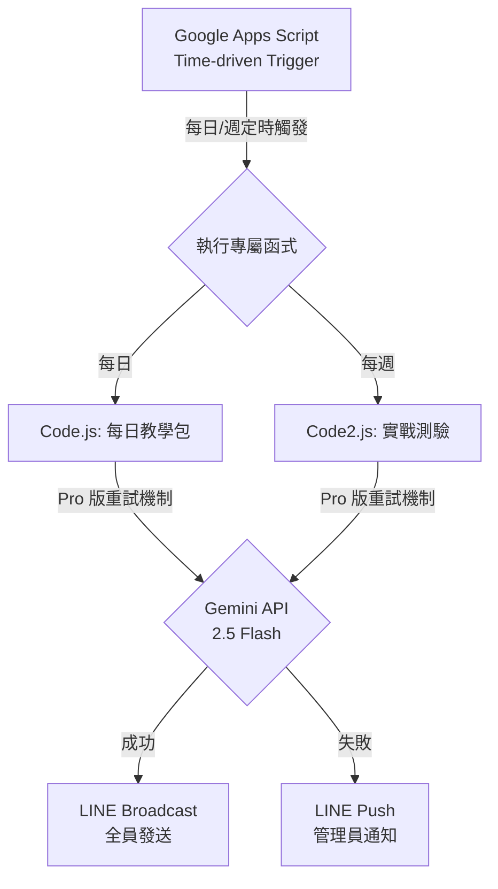

# AutoTOEIC-Daily (Pro 版)

這是一個基於 AI 自動化技術的每日多益學習系統。透過 **Google Apps Script (GAS)** 結合 **Gemini API**，每日自動生成高質量的學習內容，並透過 **LINE Messaging API** 精準推播至所有訂閱者。

## 系統架構圖

## 專案特色

- **Pro 版健壯性 (Robustness)**：內建最高 5 次的自動重試機制，能有效應對 Gemini API 偶發性的忙碌 (429/503 錯誤)。
- **指數退避演算法 (Exponential Backoff)**：每次重試的等待時間會自動增加（5s -> 7.5s -> 11s...），給予 API 伺服器充足的恢復時間。
- **雙重功能**：
  - `Code.js`：每日 20 個單字、例句、情境短文與中文翻譯。
  - `Code2.js`：每週 5 題多益模擬試題與深度解析。
- **排版優化**：自動清洗 AI 生成的 Markdown 符號，確保在手機版 LINE 上呈現最完美的純文字閱讀體驗。
- **異常自動通報**：若 5 次重試皆失敗，系統會自動轉向 `push` 模式，將詳細錯誤碼直接發送給管理員私訊，確保問題能被即時發現。

---

## 🛠 自動化重試機制說明

本專案採用效能穩定的 Pro 級錯誤處理機制，流程如下：

1. **偵測狀態碼**：當收到 `503 Service Unavailable` 或 `429 Too Many Requests`。
2. **進入等待期**：暫停執行 `Utilities.sleep(retryDelay)`。
3. **動態調整**：每次重試後將等待時間乘以 `1.5`，避免對伺服器造成持續壓力。
4. **最後手段**：若滿 5 次仍失敗，則封裝錯誤訊息，呼叫 `push` 介面私訊管理員。

---

## 🚀 Google Apps Script (GAS) 部署流程

### 1. 建立專案
1. 進入 [Google Apps Script 官網](https://script.google.com/) 並點擊「新專案」。
2. 將專案命名為 `AutoTOEIC-Daily`。

### 2. 導入程式碼
1. 在左側左單點擊 `+` 號，新增兩個指令碼檔案：
   - 檔案 1：命名為 `Code` (對應專案中的 `Code.js`)
   - 檔案 2：命名為 `Code2` (對應專案中的 `Code2.js`)
2. 將本地對應檔案中的程式碼完整複製並貼上，並**確保填入您的金鑰資訊**。

### 3. 設定定時觸發器 (重要)
這是讓程式自動運作的關鍵：
1. 點擊 GAS 編輯器左側導覽列的 **「觸發條件」(鬧鐘圖示)**。
2. 點擊右下角的 **「新增觸發條件」**：
   - **每日教學包設定**：
     - 選擇函式：`sendDailyEnglishToLine`
     - 選擇部署：`主要`
     - 活動來源：`時間驅動`
     - 類型：`每日計時器`
     - 時段：建議選擇 `上午 08:00 到 09:00`
   - **每週測驗設定 (再次點擊新增)**：
     - 選擇函式：`sendWeeklyQuizToLine`
     - 活動來源：`時間驅動`
     - 類型：`每週計時器`
     - 選擇週幾：例如 `每週六`
     - 時段：建議選擇 `上午 09:00 到 10:00`

### 4. 手動授權與測試
1. 回到程式碼編輯器，上方選單選擇 `sendDailyEnglishToLine`。
2. 點擊 **「執行」**。
3. 系統會跳出授權視窗，請點擊「查看權限」，選擇您的帳號，並點擊「進階」->「前往 AutoTOEIC-Daily (不安全)」完成授權。
4. 檢查您的 LINE 是否收到測試內容。

---

## 🔑 金鑰申請流程參考

- **Gemini API**：於 [Google AI Studio](https://aistudio.google.com/) 取得。
- **LINE Token**：於 [LINE Developers Console](https://developers.line.biz/console/) 取得。
  - 需要 Channel access token (Message API)
  - 需要 Your user ID (Basic settings) 用於系統報錯。

---

## 注意事項
- 請勿將帶有真實金鑰的代碼上傳至公開的 GitHub 倉庫。
- 如果需要修改推播主題或難度，請直接在原始碼的 `prompt` 變數中進行調整。
