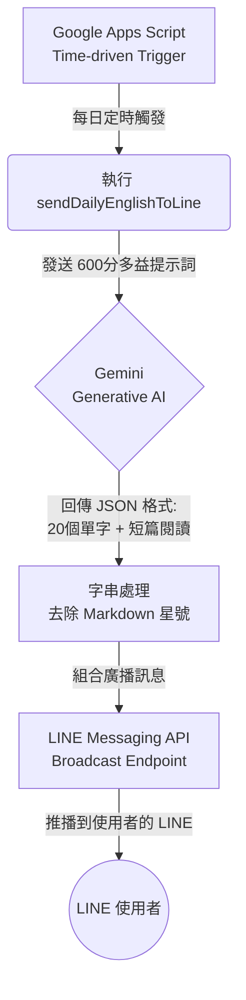

# AutoTOEIC-Daily

這是一個每日定時發送英文單字與文章至 LINE 官方帳號的自動推播專案。透過 Google Apps Script (GAS) 結合 Gemini API，每日自動生成多益學習內容並由 LINE 廣播給所有訂閱者。

## 系統流程圖

## 專案特色

- **AI 自動生成 (Gemini API)**：每日動態生成多益情境單字及短篇商業文章，保證每日內容不同。
- **LINE 廣播 (Broadcast)**：自動推播學習內容至 LINE 官方帳號的所有訂閱者。
- **純雲端執行 (Google Apps Script)**：不需要伺服器，利用 GAS 內建的每日定時觸發器 (Cron) 自動運行。

## 目錄結構
- `Code.js`：Google Apps Script 的主要邏輯腳本（已隱藏敏感金鑰）。
- `.gitignore`：過濾敏感檔案（如 `.env`, `.clasp.json` 等）。

## 🔑 金鑰申請流程

### 1. 取得 Gemini API Key (`GEMINI_API_KEY`)
1. 前往 [Google AI Studio](https://aistudio.google.com/) 並登入 Google 帳號。
2. 點擊左側選單的 **「Get API key」**。
3. 點擊 **「Create API key」**，選擇建立在新的專案或現有專案。
4. 複製生成的字串（通常以 `AIza` 開頭）。

### 2. 取得 LINE 存取權杖與使用者 ID (`LINE_ACCESS_TOKEN`, `LINE_USER_ID`)
1. 確認您已經有一個 LINE 帳號，並前往 [LINE Developers Console](https://developers.line.biz/console/) 登入。
2. 點擊 **「Create a new provider」** 建立服務提供者。
3. 在 Provider 內點擊 **「Create a Messaging API channel」** 建立官方帳號。填寫必要資訊後完成建立。
4. **取得 LINE_ACCESS_TOKEN**：
   - 點進剛建立的頻道，切換到 **「Messaging API」** 頁籤。
   - 捲動到最底部的 Channel access token (long-lived)，點擊 **「Issue」** 生成，並將字串複製下來。
5. **取得 LINE_USER_ID**（如果您需要單獨發訊息給自己測試）：
   - 切換到 **「Basic settings」** 頁籤。
   - 捲動到下方找到 **Your user ID**，這是一串以 `U` 開頭的字串，請複製下來。

## 如何使用

1. 前往 [Google Apps Script](https://script.google.com/) 建立一個新專案。
2. 將 `Code.js` 的內容複製貼上。
3. 依照上述說明申請，並替換程式碼頂端的常數為您自己真實的 Token：
   - `GEMINI_API_KEY`
   - `LINE_ACCESS_TOKEN`
   - `LINE_USER_ID`
4. 在 GAS 專案左側選單選擇「觸發條件 (Triggers)」。
5. 新增觸發條件，選擇 `sendDailyEnglishToLine` 函式，並設定為「時間驅動」的「每日計時器」，指定您希望發送的時間（例如：早上 8:00 - 9:00）。
